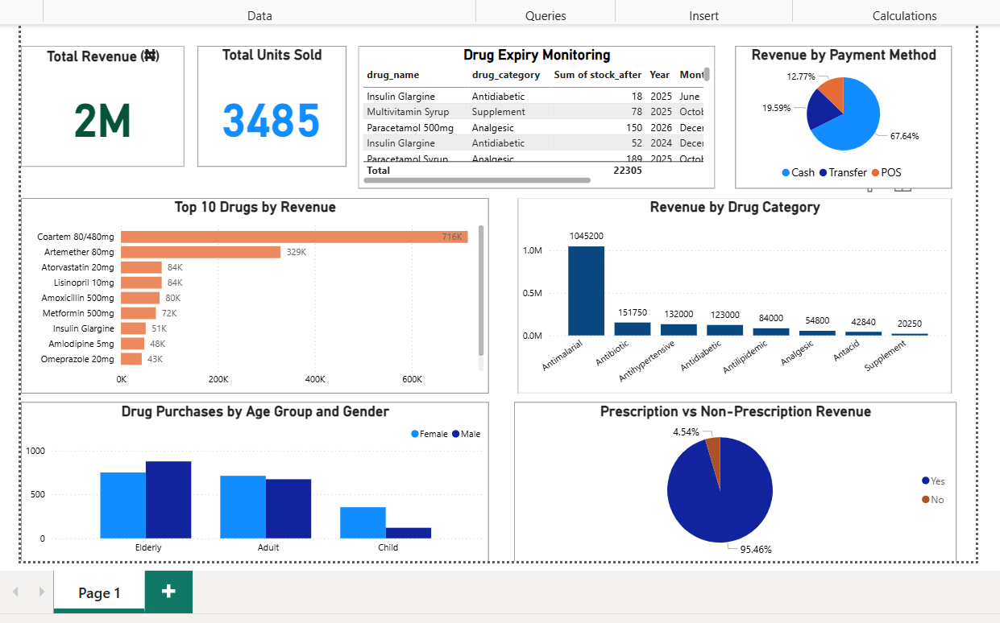

# Pharmacy Sales Dashboard — Nigeria

## Overview

This project presents a **Power BI dashboard analyzing pharmacy sales data in Nigeria**.
The dashboard provides insights into **revenue performance, drug sales trends, payment methods, and customer demographics** to help pharmacy managers make **data-driven decisions** about inventory and operations.

---

## Business Questions

This analysis answers key business questions such as:

* Which drugs generate the **highest revenue**?
* What **drug categories** sell the most?
* How many **units of drugs** are sold in total?
* What are the **most common payment methods** used by customers?
* How do **patient age groups and genders** contribute to drug purchases?
* What drugs have the **earliest expiry dates** and require monitoring?
* What proportion of sales come from **prescription vs non-prescription drugs**?

---

## Dataset

The dataset contains **pharmacy sales transactions in Nigeria**.

**Number of records:** 170

### Columns included

* transaction_id
* date
* drug_name
* drug_category
* brand_generic
* quantity_sold
* unit_price_naira
* total_revenue_naira
* supplier
* expiry_date
* stock_before
* stock_after
* patient_age_group
* patient_gender
* prescription_required
* payment_method
* pharmacist_on_duty
* branch_location
* days_to_expiry
* reorder_level_met

> All patient information is anonymized.

---

## Tools Used

* **MySQL** — Data storage and querying
* **Power BI Desktop** — Data visualization and dashboard development

---

## Dashboard Features

### Key Performance Indicators (KPIs)

* **Total Revenue**
* **Total Units Sold**

### Sales Performance

* **Top 10 Drugs by Revenue**
* **Revenue by Drug Category**

### Customer & Operational Insights

* **Revenue by Payment Method**
* **Drug Purchases by Patient Gender**
* **Drug Purchases by Age Group**

  * Children
  * Adult
  * Aged
* **Prescription vs Non-Prescription Revenue**

### Inventory Monitoring

* **Drug Expiry Monitoring Table**

The dataset currently shows **no drugs at immediate risk of expiry**, with the earliest expiry approximately **482 days away**.

---

## Dashboard Preview

---

## Project Structure

pharmacy_sales_dashboard

LICENSE
README.md
Pharmacy_sales_project.pbix
pharmacy_sales_nigeria.csv
pharmacy_dashboard.png

---

## Future Improvements

Possible extensions of this project include:

* Multi-branch pharmacy analysis
* Time-series sales trends
* Drug demand forecasting
* Inventory optimization models
* Integration with live pharmacy databases

---

## Author

**Onyinyechi Okereke**

Pharmacist | Data Analyst & Data Scientist

---

## License

This project is licensed under the **MIT License**.

